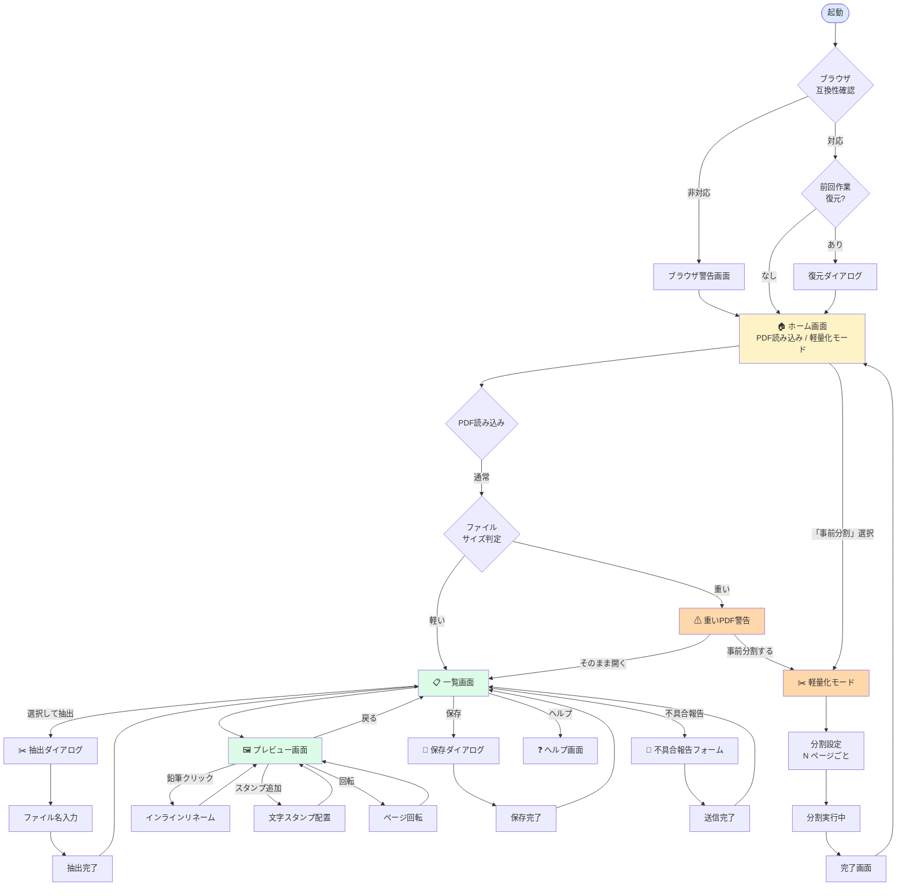
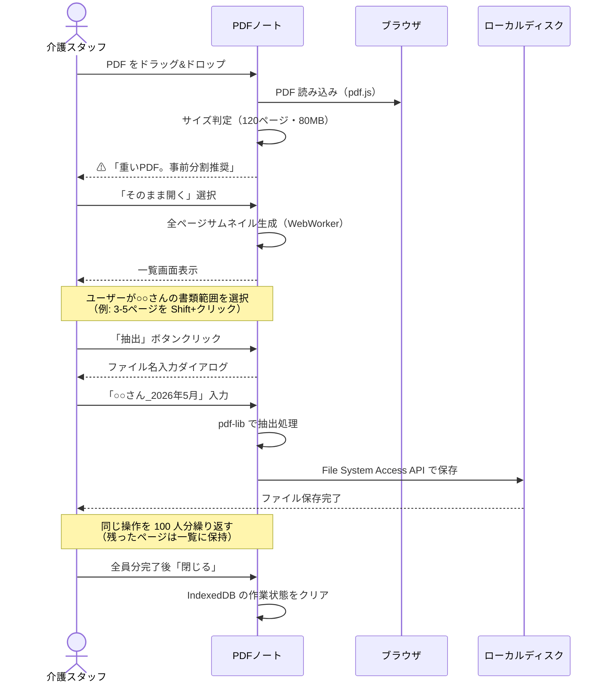
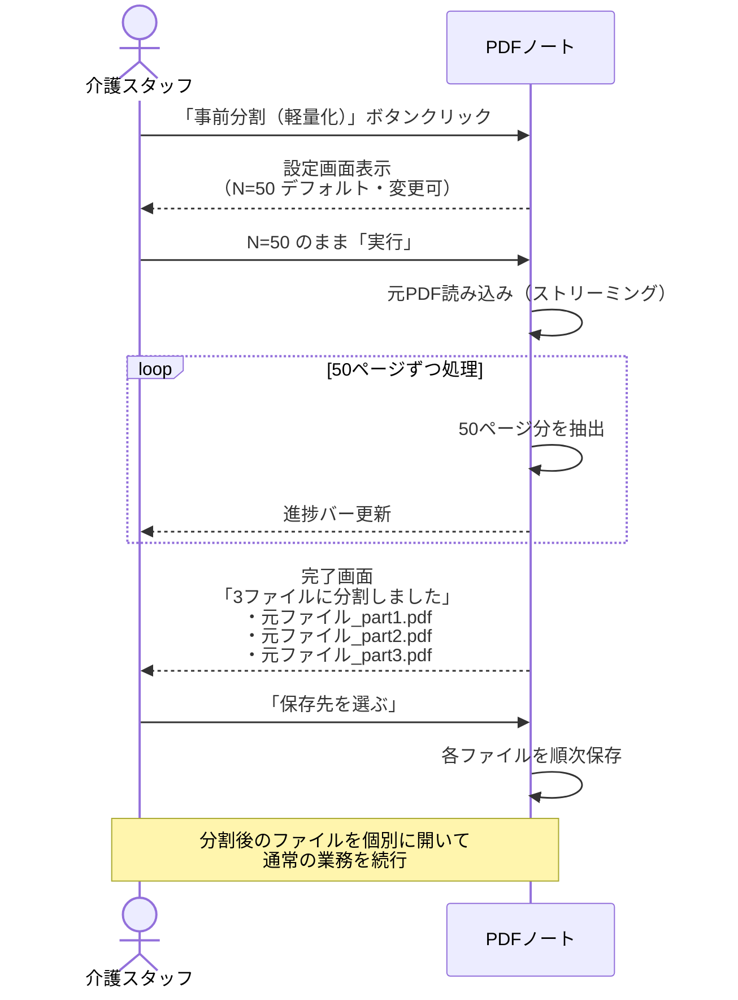
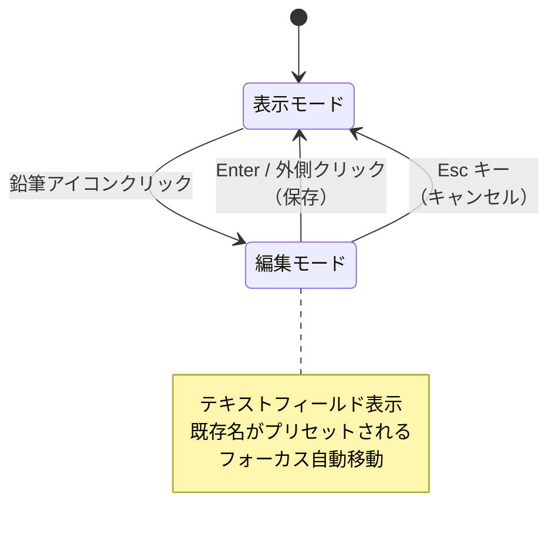
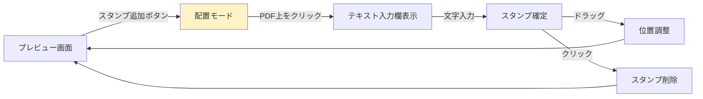
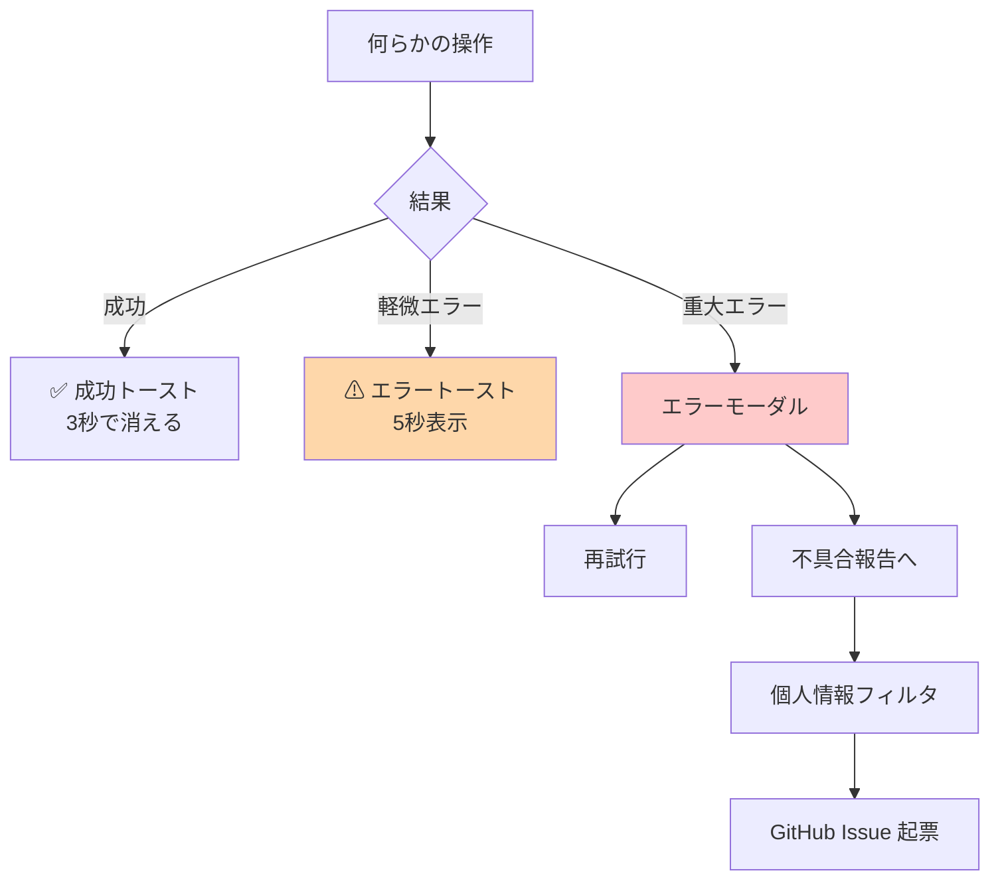

# PDFノート 画面遷移図

**バージョン:** 0.1（Phase 0 ドラフト）
**最終更新:** 2026-05-23

---

## 1. 全体画面フロー

---

## 2. 主要操作フロー: 「100人分PDF を人ごとに分割」

---

## 3. 軽量化モードフロー

---

## 4. リネーム操作フロー（鉛筆アイコン）

---

## 5. スタンプ操作フロー

---

## 6. エラー処理フロー

